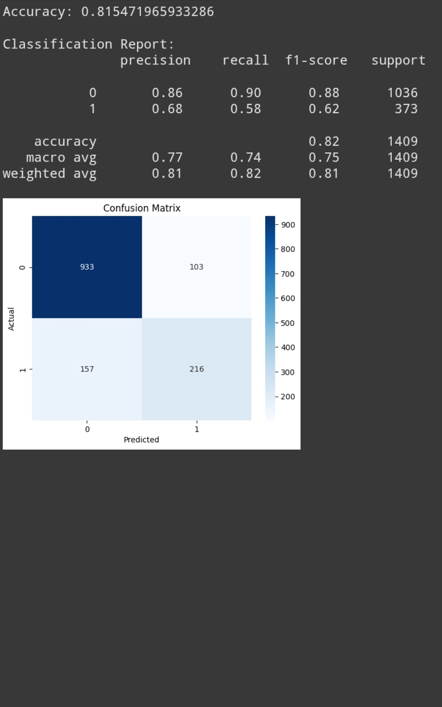

# Customer Churn Prediction (Telco Dataset)

This project is a machine learning pipeline that predicts customer churn using a logistic regression model trained on a Telco customer dataset.

---

## 📂 Dataset Description

The dataset includes customer account information, services, and demographics:
- Total Rows: ~7,000+
- Features: `gender`, `SeniorCitizen`, `Partner`, `Dependents`, `tenure`, `PhoneService`, `InternetService`, `OnlineSecurity`, `MonthlyCharges`, `TotalCharges`, `Churn`, etc.
- Target Variable: **Churn (Yes/No)**

---

## 🛠 Technologies Used
- Python
- Pandas, NumPy
- Scikit-learn
- Matplotlib, Seaborn

---

## 🔍 Steps Performed

1. **Data Cleaning**  
   - Converted `TotalCharges` to numeric.
   - Filled missing values with median.

2. **Data Preprocessing**  
   - Label Encoding of categorical columns.
   - Feature Scaling using StandardScaler.
   - Target variable mapped to binary (Yes → 1, No → 0).

3. **Model Training**  
   - Logistic Regression model used.
   - Train-Test Split: 80/20 ratio.

4. **Model Evaluation**  
   - **Accuracy:** `81.5%`
   - Classification Report:
     ```
     Precision | Recall | F1-score
     --------------------------------
     Class 0:   0.86     0.90    0.88
     Class 1:   0.68     0.58    0.62
     ```

5. **Confusion Matrix**
   

---

## 📊 Accuracy Summary

| Metric       | Value     |
|--------------|-----------|
| Accuracy     | 81.5%     |
| Macro Avg F1 | 75%       |
| Weighted F1  | 81%       |

---

## ✅ How to Run This Project

### Step 1: Install Dependencies
```bash
pip install -r requirements.txt
```

### Step 2: Open Jupyter or Google Colab
Upload and run the notebook: `Customer_Churn_Prediction.ipynb`

### Step 3: Explore the Results
Check the output cell for accuracy, classification report, and confusion matrix plot.
---

## 📌 Author
**Usman Bahadar**  
Machine Learning & AI Student | Python Enthusiast  
